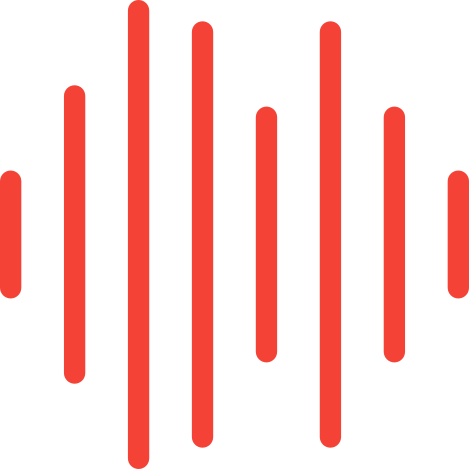

<!-- AUTO-GENERATED-CONTENT:START (STARTER) -->

  

<h1 align="center">
  Spectogram
</h1>

A real-time audio processing module that records audio from the microphone and visualizes the loudness of the audio signal.

Vertical height represents the frequency from low to high tones (Hz).
Colour represents the loudness (Db).

## 🚀 Usage

1.  **Open the Spectrogram site.**

    Link: https://renchris.github.io/spectrogram/

1.  **Enable your microphone.**

    Click on the display and allow "use your microphone" if prompted

1.  **Speak, sing, or make noise!**

    Your audio will be visualzed on the display. The louder your audio is, the brighter it will be. The higher or lower pitched your audio, the higher or lower positioned it will be, respectively.

    _Note: Computer microphones will compress the input audio to lower quality so you'll likely see less high frequency ranges being displayed._

    The browser will update in real time!

## 🧐 What's inside?

A quick look at the top-level files and directories you'll see in a Gatsby project.

    src
    ├── images
    |     └── wave.svg
    └── pages
          ├── index.css
          └── index.js

2.  **`/src`**: This directory will contain all of the code related to what you will see on the front-end of your site (what you see in the browser) such as the site header or a page template. `src` is a convention for “source code”.

3.  **`/images`**: This directory contains the images used in the project.

4.  **`wave.svg`**: This file is the project logo: a red sound wave. This is used for the favicon, header, and README.

5.  **`/pages`**: This directory contains the project javascript file as well it's respective css styling file.

6.  **`index.css`**: This file contains the styling for index.js. It adds styling to the body, div, header, and canvas.

7.  **`index.js`**: This file is the project Javascript file. We set up the HTML layout of the webpage and the functions that run when the canvas or text is clicked. When clicked for the initial time, we start getting the input from the microphone to display the data to the canvas. We set up our canvas dimensions, analyze the incoming audio stream from the microphone input, and display that audio stream as data. The data is taken at every monitor screen frame and is represented as a line with different hues at different heights along it's vertical length. The vertical position represents the frequency; the higher the position, the higher the frequency. The brighter the hue is at a certain position means more data was picked up (ie. being more loud) at that certain frequency.

<!-- AUTO-GENERATED-CONTENT:END -->
